## เขียนโค้ด plantuml สำหรับ type ชนิดอื่นๆ โดยใช้วิธีเดียวกันกับขั้นตอนที่ 3 เพื่อสร้าง diagram สำหรับ predefined type ทุกชนิด

# sByte
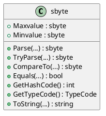

# byte
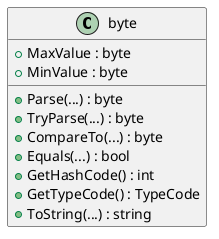

# short
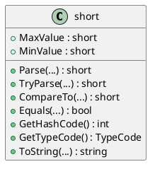

# ushort
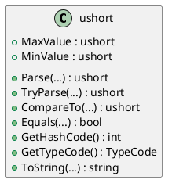

# int
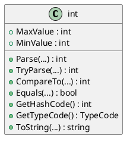

# uint
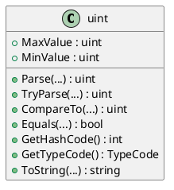

# long
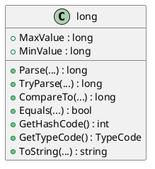

# ulong

# float
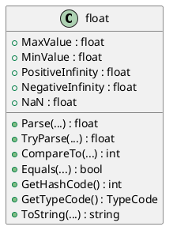

# Double
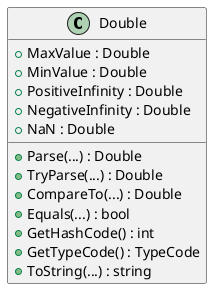

# bool
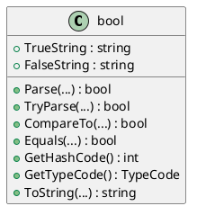

# char
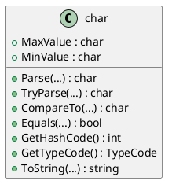

# decimal
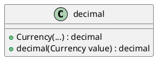

# object
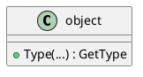

# string
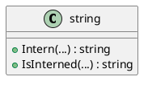

# dynamic
### dynamic ใน C# ไม่ได้มีการกำหนดประเภทข้อมูลแบบมีโครงสร้าง (structure) และมีการติดต่อกับทุกประเภทข้อมูลใน runtime โดยไม่มีการตรวจสอบประเภทใน compile time จึงไม่มีข้อมูลที่แน่นอน
