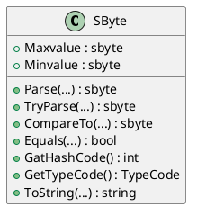
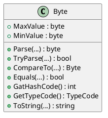
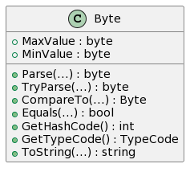
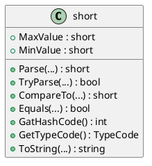
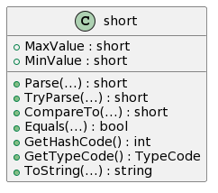

# HOMEWORK 1/4/2024
## แบบฝึกหัด
### เขียนโค้ด plantuml สำหรับ type ชนิดอื่นๆ โดยใช้วิธีเดียวกันกับขั้นตอนที่ 3 เพื่อสร้าง diagram สำหรับ predefined type ทุกชนิด

# SByte

```plantuml   
@startuml
class SByte
{
  + Maxvalue : sbyte
  + Minvalue : sbyte

  + Parse(...) : sbyte 
  + TryParse(...) : sbyte
  + CompareTo(...) : sbyte
  + Equals(...) : bool
  + GatHashCode() : int
  + GetTypeCode() : TypeCode
  + ToString(...) : string
}
@enduml
#Sittha Klaphanich
```

# Byte

```plantuml
@startuml
class Byte
{
  + MaxValue : byte
  + MinValue : byte

  + Parse(...) : byte
  + TryParse(...) : bool
  + CompareTo(...) : Byte
  + Equals(...) : bool
  + GatHashCode() : int
  + GetTypeCode() : TypeCode
  + ToString(...) : string
}
@enduml
#Sittha Klaphanich
```

# Short

```plantuml
@startuml
class short
{
  + MaxValue : short
  + MinValue : short

  + Parse(...) : short
  + TryParse(...) : bool
  + CompareTo(...) : short
  + Equals(...) : bool
  + GatHashCode() : int
  + GetTypeCode() : TypeCode
  + ToString(...) : string
}
@enduml
#Sittha Klaphanich
```

