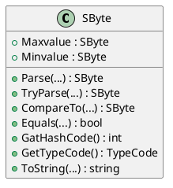

# การทดลองสัปดาห์ที่ 5.1 #
## ศึกษา data structure  และ methods ของ predefined type ในภาษา C#  ##


### Learning Outcome ###
1. นักศึกษารู้จัก predefined type และบอกได้ว่ามีอะไรบ้าง
2. นักศึกษารู้จักองค์ประกอบของ predefined type แต่ละชนิดและสามารถสร้างแผนภาพอธิบาย type เหล่านั้นได้

### ความรู้เบื้องต้น ###
#### 1.  Predefined type ในภาษา C# ####

Predefined type ในภาษา C# มีอยู่ด้วยกัน 16 ชนิด (สำหรับคนที่ update เป็น C# version 9 แล้ว จะมี 18 ชนิด) ดังรูปที่ 1


<p align = "center"> <b>รูปที่ 1</b>  predefined type ในภาษา C# </p>

#### 2. การเข้าถึง predefined type โดยใช้ Visual Studio IDE ####
เราสามารถอาศัยเครื่องมือใน text editor ของ Visual Studio เข้าถึงนิยามของ predefined type ได้โดยการกดปุ่ม F12 หรือ กดปุ่ม Ctrl บนคีย์บอร์ดแล้วใช้เมาส์คลิกที่ขื่อของ Type นั้นๆ

##### ลำดับขั้นการทดลอง #####

1. สร้าง console project ใน Visual studio สมมติว่าตั้งชื่อ project เป็น `Week05_Lab1`


2. แก้ไขไฟล์ `program.cs` มีเนื้อหาดังต่อไปนี้


```cs
class Program
{
    sbyte sb;
    byte bt;
    short sh;
    ushort ush;
    int ii;
    uint ui;
    long lo;
    ulong ul;
    float fl;
    double db;
    bool bl;
    char ch;
    decimal de;

    object ob;
    string st;
    dynamic dy;

    static void Main(string[] args)
    {

    }
}
```

<p align = "center"> <b>รูปที่ 2 </b> Source code  ของ program.cs</p>


3. กดปุ่ม Ctrl แล้วใช้เมาส์คลิกที่ `sbyte` โปรแกรม Visual Studio จะเปิดไฟล์ใหม่ขึ้นมา ซื่งมือเนื้อหาของ `System.Sbyte`


จะสังเกตได้ว่าในบรรทัดที่ 12 มีการสร้าง type ของข้อมูลเป็น `struct` ซึ่งมีการ สืบทอดมาจาก `Interface` หลายชนิด (จะได้เรียนเรื่อง `interface` ในภายหลัง)

ในบรรทัดที่ 18 และ 22 มีตัวแปรแบบ `public const SByte` จำนวนสองตัว ซึ่งทำหน้าที่บอกค่าสูงสุด (`MaxValue`) และค่าต่ำสุด  (`MinValue`) ที่สามารถเก็บในตัวแปรชนิดนี้ 

จากค่า `MaxValue`  และ   `MinValue` ทำให้เรารู้ได้ว่าตัวแปรที่สร้างจาก type นี้มีขนาด 8 บิตแบบคิดเครื่องหมาย นั่นคือต้องใช้บิดซ้ายสุดจำนวน 1 บิตเป็นตัวเก็บเครื่องหมาย (ถ้าบิตนี้มีค่า 0 คือจำนวนเต็มบวก ถ้าเป็น 1 จะเป็นจำนวนเต็มลบ) ดังนั้นจึงสามารถมีข้อมูลได้ 7 บิต (แทนค่าเป็นเลขฐานสิบได้ 0-127)

`1 0000000` ถึง `1 1111111` เป็นค่าลบ

`0 0000000` ถึง `0 1111111` เป็นค่าบวก


บรรทัดที่ 27 ถึง 338 จะเป็น methods ของชนิดข้อมูลนี้ ทำให้เรารู้ว่าสามารถทำอะไรกับชนิดข้อมูลนี้ได้บ้าง  

ถ้าลองคลิ่ folding โดยการคลิกที่เครื่องหมาย [+] เราจะเห็นข้อความอธิบายอยู่ใน comment ดังรูปที่ 3


<p align = "center"> <b>รูปที่ 3</b> คำอธิบาย method ของ SByte </p>

4. วาดไดอะแกรมของ type นี้ด้วย plantuml



เมื่อ render ด้วยโปรแกรม plantuml แล้วจะได้คลาสไดอะแกรมดังนี้


<p align = "center"> <b>รูปที่ 4</b> diagram สำหรับ SByte </p>


----------
__หมายเหตุ__ 

รูปแบบของการเขียนรายละเอียดของตัวแปรและ function ใน class diagram คือ
```
< +|-|# > name [ : < return-type > ]
```
เมื่อ
```
+ คือการเข้าถึงแบบ public
- คือการเข้าถึงแบบ private
# คือการเข้าถึงแบบ protected

< > หมายถึงเป็นส่วนที่ต้องมี (required)
[ ] หมายถึงเป็นส่วนที่ไม่ต้องก็ได้ (optional)

เช่น 
 + Maxvalue : SByte     //  ในกรณีที่ต้องการระบุให้ชัดเจนเนื่องจากรู้ชนิดล่วงหน้าแล้ว
 หรือ 
 + Maxvalue             // ในกรณีที่ยังไม่รู้ชนิดล่วงหน้า 

```
ในกรณีที่ชื่อฟังก์ชันเหมือนกันแต่มี parameter ต่างกันให้เขียน parameter  เป็น (...) แล้วใช้ฟังก์ชันเดียวเท่านั้น

----------

## แบบฝึกหัด ##

เขียนโค้ด plantuml สำหรับ type ชนิดอื่นๆ โดยใช้วิธีเดียวกันกับขั้นตอนที่ 3  เพื่อสร้าง diagram สำหรับ predefined type ทุกชนิด


