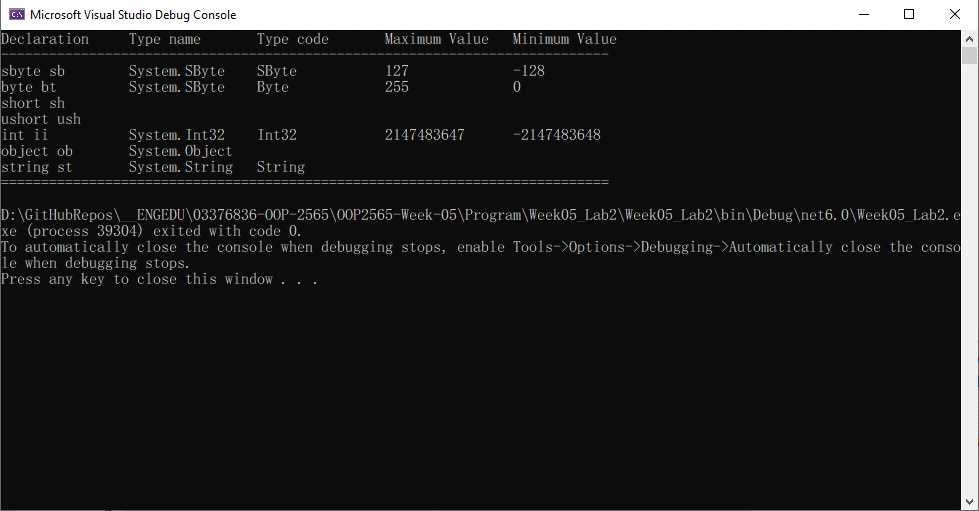

# การทดลองสัปดาห์ที่ 5.2 #
## แสดงรายละเอียดของ predefined type ในภาษา C#  ##


### Learning Outcome ###
1. นักศึกษารู้จัก predefined type และบอกได้ว่ามีอะไรบ้าง
2. นักศึกษาสามารถเขียนโปรแกรมเพื่อรายงานค่าเฉพาะตัวของ predefined type ได้

## แบบฝึกหัด ##

แก้ไขโค้ดตัวอย่าง ให้รายงานรายละเอียดของ predefine type ได้ครบถ้วน

Type ใดที่ไม่มี properties ที่กำหนดให้แสดงก็ให้เว้นไว้ หรือใช้การขีด (`-`)
```cs
sbyte sb = new sbyte();  // create new object
byte bt = new byte();
short sh;                 
ushort ush;
int ii = new int();
uint ui;
long lo;
ulong ul;
float fl;
double db;
bool bl;
char ch;
decimal de;

object ob = new object();
string st = new string("");
dynamic dy;


Console.WriteLine($"Declaration\tType name\tType code\tMaximum Value\tMinimum Value");
Console.WriteLine($"----------------------------------------------------------------------------");
Console.WriteLine($"sbyte sb\t{sb.GetType()}\t{sb.GetTypeCode()}\t\t{sbyte.MaxValue}\t\t{sbyte.MinValue}");
Console.WriteLine($"byte bt\t\t{sb.GetType()}\t{bt.GetTypeCode()}\t\t{byte.MaxValue}\t\t{byte.MinValue}");
Console.WriteLine($"short sh");
Console.WriteLine($"ushort ush");
Console.WriteLine($"int ii\t\t{ii.GetType()}\t{ii.GetTypeCode()}\t\t{int.MaxValue}\t{int.MinValue} ");

Console.WriteLine($"object ob\t{ob.GetType()}");
Console.WriteLine($"string st\t{st.GetType()}\t{st.GetTypeCode()} ");

Console.WriteLine("============================================================================");

```



## แบบฝึกหัด ##
แก้ไขโค้ดตัวอย่าง ให้รายงานรายละเอียดของ predefine type ได้ครบถ้วน
```cs
class Program
{
    static void Main()
    {
        sbyte sb = new sbyte();  // create new object
        byte bt = new byte();
        short sh = new short();
        ushort ush = new ushort();
        int ii = new int();
        uint ui = new uint();
        long lo = new long();
        ulong ul = new ulong();
        float fl = new float();
        double db = new double();
        bool bl = new bool();
        char ch = new char();
        decimal de = new decimal();

        object ob = new object();
        string st = new string("");
        dynamic dy = 11;

        Console.WriteLine($"Declaration\tType name\tType code\tMaximum Value\tMinimum Value");
        Console.WriteLine($"----------------------------------------------------------------------------");
        Console.WriteLine($"sbyte sb\t\t{sb.GetType()}\t{TypeCode.SByte}\t\t{sbyte.MinValue}\t{sbyte.MaxValue}");
        Console.WriteLine($"byte bt\t\t{bt.GetType()}\t{TypeCode.Byte}\t\t{byte.MinValue}\t{byte.MaxValue}");
        Console.WriteLine($"short sh\t{sh.GetType()}{TypeCode.Int16}\t{short.MinValue}\t{short.MaxValue}");
        Console.WriteLine($"ushort ush\t\t{ush.GetType()}\t{TypeCode.UInt16}\t\t{ushort.MinValue}\t{ushort.MaxValue}");
        Console.WriteLine($"int ii\t\t{ii.GetType()}\t{TypeCode.Int32}\t\t{int.MinValue}\t{int.MaxValue}");
        Console.WriteLine($"uint ui\t\t{ui.GetType()}\t{TypeCode.UInt32}\t\t{uint.MinValue}\t{uint.MaxValue}");
        Console.WriteLine($"long lo\t\t{lo.GetType()}\t{TypeCode.Int64}\t\t{long.MinValue}\t{long.MaxValue}");
        Console.WriteLine($"ulong ul\t{ul.GetType()}{TypeCode.UInt64}{ulong.MinValue}\t{ulong.MaxValue}");
        Console.WriteLine($"float fl{fl.GetType()}{TypeCode.Single}\t{float.MinValue}\t{float.MaxValue}");
        Console.WriteLine($"double db{db.GetType()}{TypeCode.Double}\t\t{double.MinValue}\t{double.MaxValue}");
        Console.WriteLine($"bool bl\t\t{bl.GetType()}\t{bl.GetTypeCode()}\t{bool.TrueString}\t{bool.FalseString}"); 
        Console.WriteLine($"char ch\t\t{ch.GetType()}\t{TypeCode.Char}\t{char.MinValue}\t{char.MaxValue}");
        Console.WriteLine($"decimal de\t\t{de.GetType()}\t{TypeCode.Decimal}\t{decimal.MinValue}\t{decimal.MaxValue}");

        Console.WriteLine($"object ob\t\t{ob.GetType()}");
        Console.WriteLine($"string st\t\t{st.GetType()}\t{TypeCode.String}");
        Console.WriteLine($"dynamic dy\t\t{dy.GetType()}\t เปลี่ยนแปลงตามค่า static ที่ป้อนให้ข้อมูล เช่น 11 ก็เป็น int ");

        Console.WriteLine("============================================================================");
    }
}
```


65030289 นางสาว อัญชิสา เพชรน้อย


