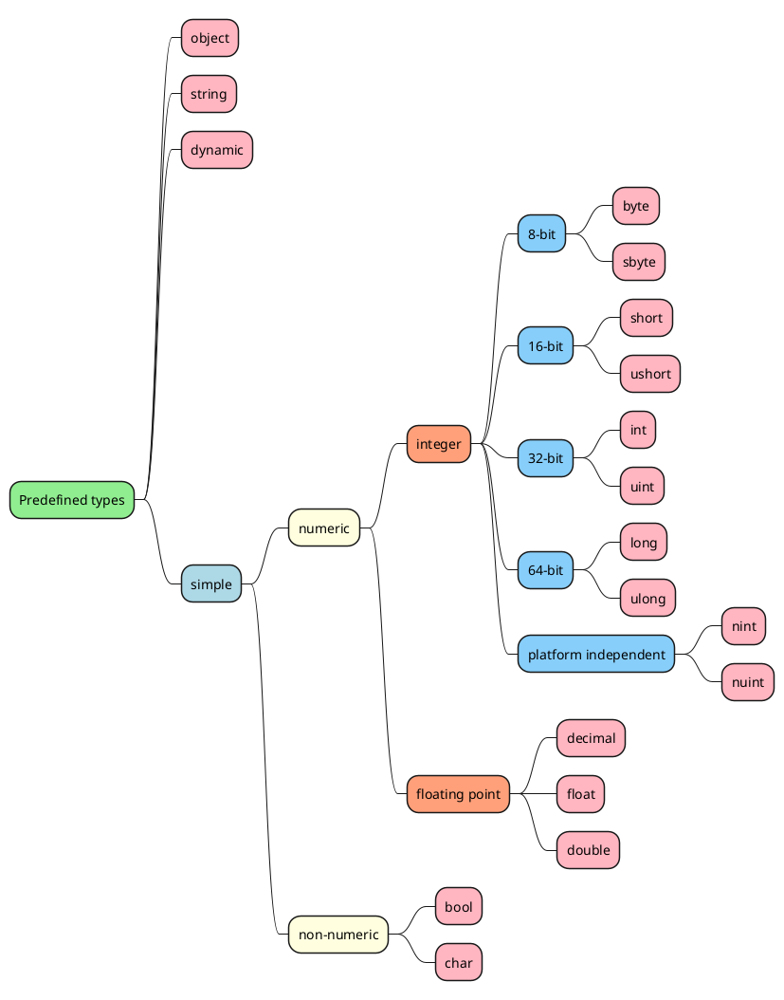

```plantuml
@startmindmap
*[#LightGreen] Predefined types
**[#LightPink] object
**[#LightPink] string
**[#LightPink] dynamic
**[#lightblue] simple
***[#LightYellow] numeric
****[#LightSalmon] integer
*****[#LightSkyBlue] 8-bit
******[#LightPink] byte
******[#LightPink] sbyte
*****[#LightSkyBlue] 16-bit
******[#LightPink] short
******[#LightPink] ushort
*****[#LightSkyBlue] 32-bit
******[#LightPink] int
******[#LightPink] uint
*****[#LightSkyBlue] 64-bit
******[#LightPink] long
******[#LightPink] ulong
*****[#LightSkyBlue] platform independent
******[#LightPink] nint
******[#LightPink] nuint
****[#LightSalmon] floating point
*****[#LightPink] decimal
*****[#LightPink] float
*****[#LightPink] double
***[#LightYellow] non-numeric
****[#LightPink] bool
****[#LightPink] char
@endmindmap
```